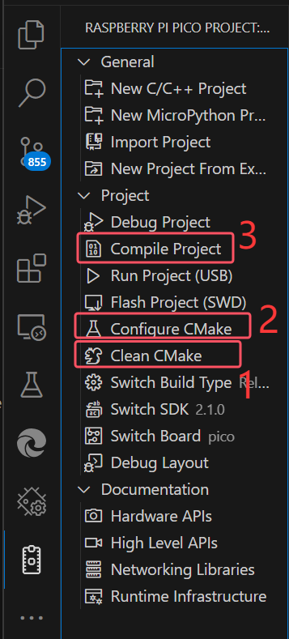

# rp2040-pico

树莓派 Pi Pico 开发板学习记录与相关demo代码资料

> 阿里云盘下载地址：
>
> * [rp2040-pico.exe](https://www.alipan.com/s/mFsYV5NsSVX)
>
> .zip 压缩包发不出来，GitHub提示文件太大，阿里云盘不让分享，摆烂。

## 依赖

* PICO SDK  ==  2.1.0

> ！：
>
> * 记得初始化子仓库
>   ```sh
>   git submodule update --init --recursive
>   ```
> * 我使用的是VSCode的[Raspberry Pi Pico](https://marketplace.visualstudio.com/items?itemName=raspberry-pi.raspberry-pi-pico)插件对环境进行管理和配置，pico SDK应该在home/下，自己去看文档
>
> vscode的 .vscode/ 项目配置相关的文件目录我也一起上传了，build/目录自己编译cmake工程去

## 烧录|运行

rp2040烧录运行那么简单，官方文档看不懂可以找其他人写的...，在不行就算了吧，可以换行了。

> ！：
>
> 在使用[Raspberry Pi Pico](https://marketplace.visualstudio.com/items?itemName=raspberry-pi.raspberry-pi-pico)插件进行编译时可能需要严格按照下面的顺序执行一遍配置：
>
> 
